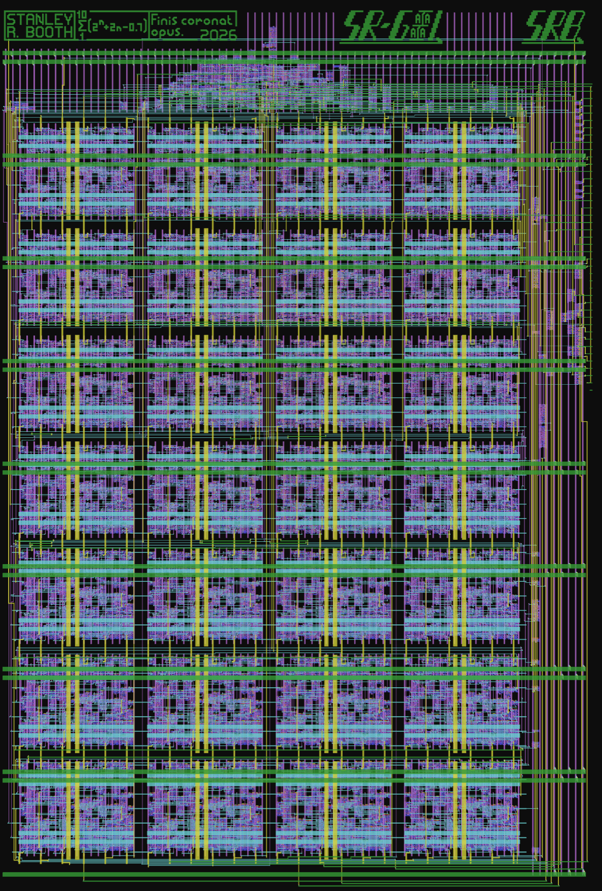
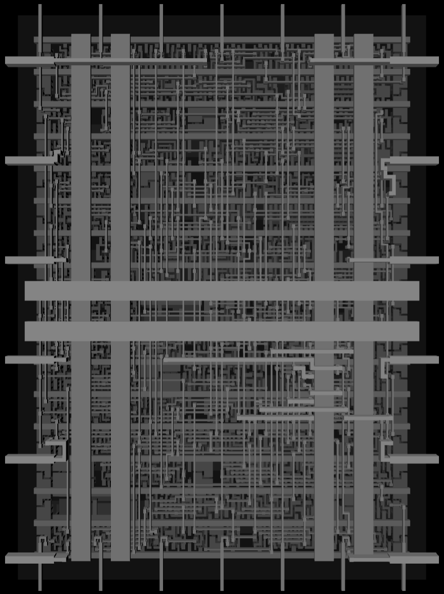
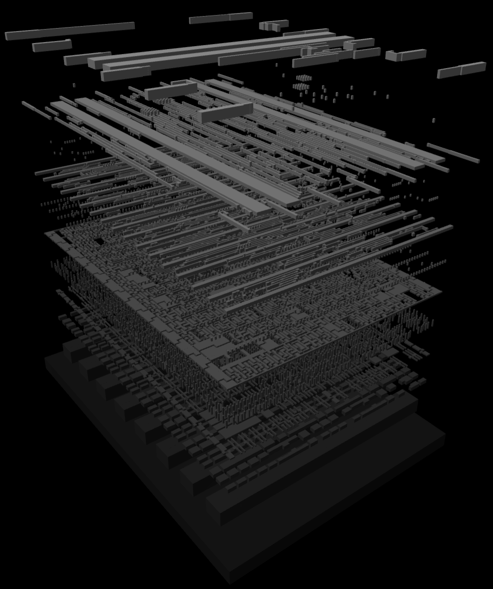

  

# SR-GA1: An FPGA-lite device
- 28 Configurable Logic Blocks (CLBs) in a 7x4 array
- 7 Column clock controllers which can be chained or source from the FPGA fabric
- Supports carry chains to easily build up to 4-bit adders.
- Simple shift in programming interface.
- Has software toolchains for creating designs using (limited) [SystemVerilog](https://github.com/SRB2149/SR-GA1/tree/main/crates/sr-ga1-synth) or by hand via a [GUI](https://github.com/SRB2149/SR-GA1/tree/main/crates/fpgatool).
- [Read the full documentation for project](docs/info.md)

# The CLB

 - 8 Logic functions (no LUT\*):
    - AND3
    - OR3
    - XOR3 (doubles as SUM3 with carry out via carry chain)
    - NAND3 
    - NOR3 
    - XNOR3 
    - AO21
    - MUX2
 - 3 Input multiplexers from which inputs can be selected from the 4 horizontal input lanes or the column carry chain
 - 8 Output multiplexers which determine the signals propagated to the CLBs above and to the right
 - 1 synchronously resettable D flip-flop with a fixed enable line and a shared column clock

\* This was done to save space.

