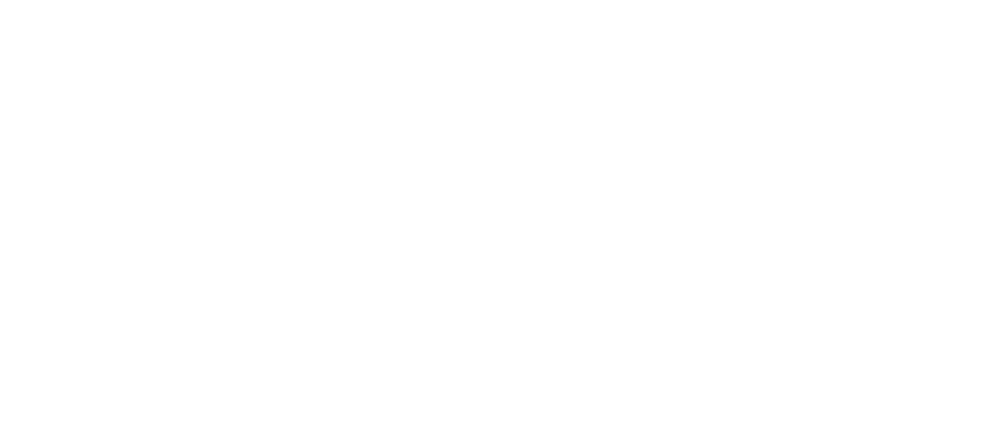

  

# An FPGA-lite device
- 32 Configurable Logic Blocks (CLBs) in an 8x4 array
- 8 Column clock controllers which can be chained together or sourced from the FPGA fabric
- Supports column carry chains to easily build up-to-4-bit adders.
- Simple shift in programming interface.
- Has software toolchains for creating designs using (limited) [SystemVerilog](https://github.com/SRB2149/SR-GA1/tree/main/crates/sr-ga1-synth) or by hand via a [GUI](https://github.com/SRB2149/SR-GA1/tree/main/crates/fpgatool).
- [Read the full documentation for project](docs/info.md)

# The CLB

 - Configurable as a LUT3 (represents 256 distinct logic functions) or 1 bit full adder
 - 3 input multiplexers from which inputs can be selected from various input sources
 - Column carry chains with dedicated carry generation logic
 - 8 output multiplexers which determine the signals propagated to the CLBs above and to the right
 - 1 synchronously resettable D flip-flop with a fixed enable line and a shared column clock
 - 25 configuration flip-flops give over 32 million possible configurations.

